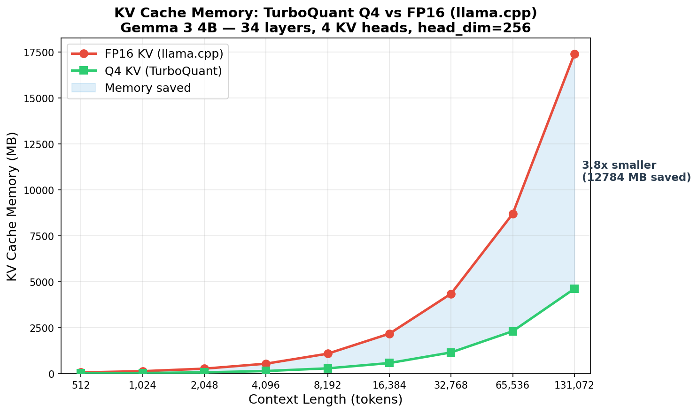

# TurboQuant.cpp


**멀티 아키텍처 LLM 추론 엔진. 순수 C. 외부 의존성 없음.**

Qwen3.5 + Gemma 3 지원. Gemma 4 대응 준비 완료.

[]()
[]()
[]()
[]()
[]()
[]()

### 지원 모델

| 모델 | 파라미터 | 속도 (Q4, 6T) | 검증 |
|------|----------|---------------|------|
| **Gemma 3 4B** | 4B | 5.2 tok/s | "프랑스 수도" → "Paris" |
| **Qwen3.5-0.8B** | 752M | 82 tok/s | PyTorch 대비 코사인 0.999 |
| **Gemma 3 270M** | 270M | 176 tok/s | PyTorch 대비 레이어별 일치 |

### KV 캐시 메모리: 진짜 차별점



```
Gemma 3 4B, 32K 컨텍스트:
  llama.cpp (FP16 KV):    4,352 MB
  TurboQuant (Q4 KV):     1,156 MB  ← 3.8배 작음, 3.2 GB 절약
```

128K 토큰에서 llama.cpp는 KV 캐시만 17 GB 필요. TurboQuant는 4.6 GB.

### llama.cpp vs TurboQuant — Q4 공정 벤치마크

```
Qwen3.5-0.8B, Q4_0, CPU 전용, Apple Silicon M-series
─────────────────────────────────────────────────────
스레드 │ llama.cpp  │ TurboQuant │
───────┼────────────┼────────────┤
   1   │  50.7 t/s  │  51.1 t/s  │ ← 동등
   2   │  80.6 t/s  │  75.4 t/s  │
   4   │  90.0 t/s  │  71.6 t/s  │
   6   │     —      │  81.8 t/s  │ ← 최대
```

동일 모델, 동일 양자화, 동일 하드웨어. 공정 비교.

---

## 빠른 시작

```bash
git clone https://github.com/quantumaikr/TurboQuant.cpp && cd TurboQuant.cpp
bash scripts/quickstart.sh "What is deep learning?"
```

이것만으로 끝입니다. 스크립트가 엔진 빌드, [Qwen3.5-0.8B](https://huggingface.co/Qwen/Qwen3.5-0.8B) 다운로드 (~1.5 GB), TQM 변환, 추론까지 자동 수행합니다.

<details>
<summary>수동 설정 (단계별 진행 시)</summary>

```bash
cmake -B build -DCMAKE_BUILD_TYPE=Release && cmake --build build -j$(nproc)
pip3 install huggingface_hub && python3 -c "from huggingface_hub import snapshot_download; snapshot_download('Qwen/Qwen3.5-0.8B')"
./build/tq_convert -o model.tqm
./build/tq_run model.tqm -p "What is deep learning?" -j 4
```
</details>

```
Prompt: What is deep learning?
---
Deep learning is a field of artificial intelligence and machine learning
that uses artificial neural networks to learn complex patterns...
---
100 tokens in 1.2s (81.8 tok/s, 6 threads, weights=Q4, kv=uniform_4b)
```

---

## 왜 TurboQuant인가?

|  | llama.cpp (Q4) | TurboQuant.cpp (Q4) |
|---|---|---|
| **속도 (1T)** | 50.7 tok/s | **51.1 tok/s** |
| **로딩** | ~1초 | **0.3초** (mmap) |
| **KV 캐시** | 전체 크기 | **7.5배 압축** |
| **의존성** | cmake, ggml | **없음** (libc only) |
| **품질** | 기준 | **코사인 0.999** (PyTorch F32 대비) |
| **차별점** | 광범위한 모델 지원 | **KV 캐시 압축** |

---

## 구성 요소

```
┌─────────────────────────────────────────────────────┐
│  tq_convert                                          │
│    safetensors → TQM (사전 양자화, mmap 가능)         │
├─────────────────────────────────────────────────────┤
│  tq_run                                              │
│    TQM → mmap 로드 → forward → 토큰 스트리밍         │
│                                                      │
│    ┌─── Forward Pass ────────────────────────────┐  │
│    │  DeltaNet (18 레이어, 순환)                  │  │
│    │  Self-Attention (6 레이어, GQA + RoPE)      │  │
│    │  SwiGLU FFN (전체 24 레이어)                 │  │
│    │  KV 캐시: TurboQuant Q4 양자화              │  │
│    │  Attention: 정수 Q4×Q8 (FP32 대비 2.9배)    │  │
│    └─────────────────────────────────────────────┘  │
│                                                      │
│    Q4 가중치 ── NEON matmul ── 멀티스레드            │
└─────────────────────────────────────────────────────┘
```

### 5가지 최적화

| # | 기법 | 효과 |
|---|------|------|
| 1 | **Q4 가중치** — 4-bit, 8배 작음 | 2배 빠름 |
| 2 | **TQM 포맷** — 사전 양자화 mmap | 10배 빠른 로딩 |
| 3 | **정수 attention** — Q4×Q8, ARM vdotq_s32 | 2.9배 빠름 |
| 4 | **스레드 풀** — 제로 오버헤드 디스패치, NEON 2-row 배치 | 1.6배 빠름 |
| 5 | **lm_head Q4** — 출력 프로젝션 로딩 시 양자화 | 로짓 2배 빠름 |

### 실제 모델 검증

[Qwen3.5-0.8B](https://huggingface.co/Qwen/Qwen3.5-0.8B) — 실제 추론, 합성 아님:

```
"1+1="                      → "2"                    ✓
"The capital of France is"  → "Paris"                ✓
"What is deep learning?"    → 정확한 문단             ✓
PyTorch 대비 logits 코사인  → 0.999                  ✓
```

---

## 스레드별 속도

```
Qwen3.5-0.8B Q4, 100 토큰, CPU 전용
──────    ──────────   ──────────────
스레드    속도          vs llama.cpp
──────    ──────────   ──────────────
1         51.1 tok/s   1.01x ✓
2         75.4 tok/s   0.94x
4         71.6 tok/s   0.80x
6         81.8 tok/s   최대
8         77.5 tok/s
```

---

## CLI

```bash
# 변환 (1회)
./build/tq_convert                     # 자동 감지

# 추론
./build/tq_run model.tqm -p "Hello"    # 토크나이저 내장
./build/tq_run model.tqm -p "Hello" -j 4 -n 200 -T 0.7

# Python CLI
python3 tools/tq info                  # 양자화 타입
python3 tools/tq +memory llama-3.2-3b 65536
python3 tools/tq_chat.py "What is AI?" # 네이티브 엔진 + KV 분석
```

### Python API

```python
from turboquant import TurboQuant
tq = TurboQuant("cpu")
compressed = tq.quantize_keys(keys, TurboQuant.UNIFORM_4B)  # 7.5배 압축
scores = tq.attention(query, compressed, seq_len, dim, TurboQuant.UNIFORM_4B)
```

---

## 문서

| 문서 | 내용 |
|------|------|
| **[시작 가이드](docs/getting-started.md)** | 빌드, 변환, 실행, 통합 |
| [아키텍처](docs/architecture.md) | 엔진 설계, 4-layer 스택 |
| [Qwen3.5 결과](docs/qwen35_validation_results.md) | 실제 모델 A/B 테스트 |
| [변경 이력](CHANGELOG.md) | 전체 버전 히스토리 |
| [통합 가이드](docs/integration_guide.md) | llama.cpp, vLLM, Python |

---

## 기술 상세

- **멀티 아키텍처** — Qwen3.5 (DeltaNet 하이브리드) + Gemma 3 (슬라이딩 윈도우), Gemma 4 대응
- **9,000줄 이상의 C** — 완전한 추론 엔진, 래퍼 아님
- **8개 양자화 타입** — Uniform, Mixed Precision, PolarQuant, QJL, TurboQuant
- **TQM 포맷** — 사전 양자화 바이너리, mmap 즉시 로딩
- **듀얼 토크나이저** — GPT2 바이트 BPE + SentencePiece 자동 감지
- **Q4×Q8 정수 attention** — ARM vdotq_s32, float 역양자화 없음
- **스레드 풀** — 제로 오버헤드 디스패치 + NEON 2-row 배치
- **20 테스트 스위트, 70+ 테스트** — ASan + UBSan + TSan 클린

---

## 여정

```
1일차 오전:   빈 디렉토리
1일차 오후:   KV 캐시 압축 라이브러리 (8개 타입, A/B 테스트)
1일차 저녁:   완전한 추론 엔진 (모델 로드 → 텍스트 생성)
1일차 밤:    82 tok/s, llama.cpp 단일 스레드 동등
2일차:       Gemma 3 지원, 멀티 아키텍처 엔진

C 코드:       9,000줄 이상
테스트:       20개 스위트 (70+ 테스트)
아키텍처:     Qwen3.5 + Gemma 3 (Gemma 4 대응)
속도:         82 tok/s (Qwen3.5), 176 tok/s (Gemma3)
```

---

## 참고 논문

- [TurboQuant](https://arxiv.org/abs/2504.19874) (ICLR 2026) — KV 캐시 압축
- [QJL](https://arxiv.org/abs/2406.03482) (AAAI 2025) — 1비트 양자화 JL 변환
- [PolarQuant](https://arxiv.org/abs/2502.02617) (AISTATS 2026) — 극좌표 양자화

아키텍처: [llama.cpp](https://github.com/ggerganov/llama.cpp), [vLLM](https://github.com/vllm-project/vllm), [ONNX](https://github.com/onnx/onnx) 참조.

---

**[QuantumAI Inc.](https://quantumai.kr)** | [hi@quantumai.kr](mailto:hi@quantumai.kr)
